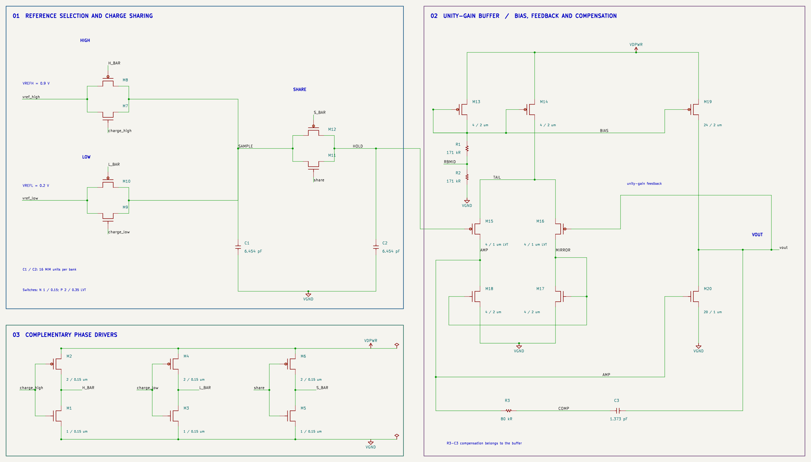
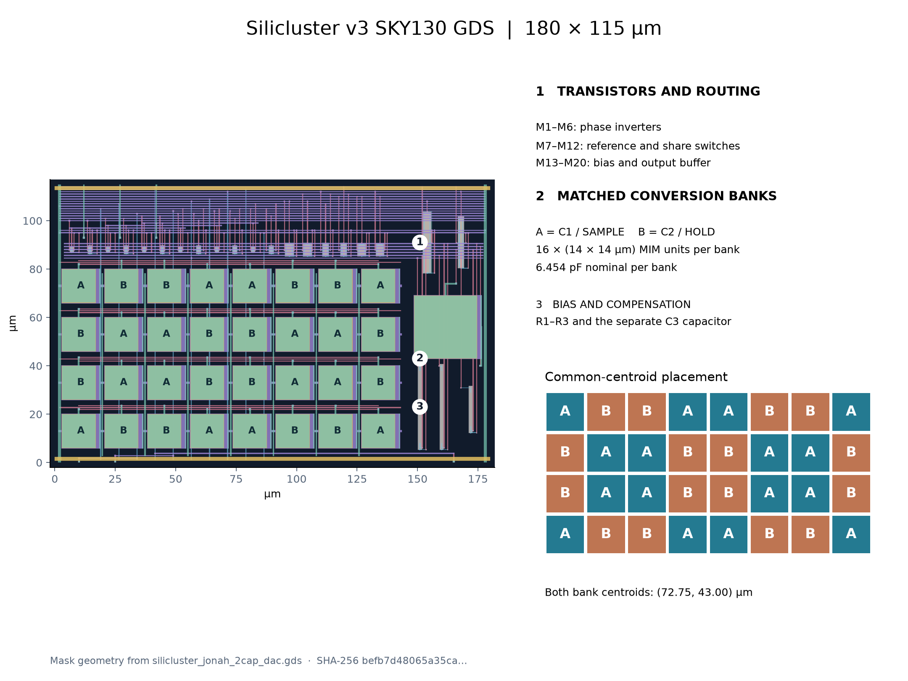

# Two-capacitor serial DAC

This implements the charge-sharing principle described by R. E. Suarez, P. R. Gray, and D. A. Hodges in *All-MOS Charge Redistribution Analog-to-Digital Conversion Techniques—Part II*, IEEE JSSC, December 1975, pp. 379–385. A [scan of the original paper](https://web.eecs.utk.edu/~dbouldin/protected/gray-dec75.pdf) includes Part II beginning on journal page 379. The historical conversion principle is adapted to SKY130 CMOS transmission gates and a modern unity-gain output buffer; this is not a transistor-for-transistor replica of the historical NMOS circuit.



The three functional groups share explicit named nets. M1–M6 invert the incoming phases. M7–M12 form transmission gates for charging the sample bank from either reference and sharing charge with the hold bank. M13–M20, R1–R3, and C3 implement bias and the buffer. The feedback path returns `vout` to M16. The low-threshold PMOS switch and input-pair devices support the tested low-supply conditions.

Initialize both conversion banks to Vref_low. For bit b, charge C1 to Vref_low + b(Vref_high − Vref_low). With references disconnected, sharing equal capacitors gives:

```
Vhold_next = (Vhold_previous + Vsample) / 2
```

After eight bits in LSB-first order, the ideal held voltage is Vref_low + code(Vref_high − Vref_low)/256. The high endpoint is one ideal LSB below Vref_high. Nonideal capacitance, switch charge, finite buffer gain, and mismatch are assessed using extracted-layout simulation.

Both banks retain sixteen 14 × 14 µm MIM units and nominal 6.454 pF per bank. Their centroids coincide at (72.75, 43.00) µm. The symmetric four-row, eight-column pattern reduces first-order spatial gradients; it does not eliminate all edge, routing, or manufacturing errors. Ground shields separate the long sample/hold buses and adjacent capacitor columns. C3 is a separate 26 × 26 µm MIM capacitor, nominally 1.373 pF, used only for buffer compensation.



The layout has exact 180 × 115 µm bounds and retains the electrical sizes of the source circuit. Moving capacitors into a wider, shorter array frees a narrow side region for resistors and compensation. MOS devices and routing occupy the upper region. Vertical M4 ground/supply rails meet horizontal M5 rails through via4. Signal pins are on M4. No controller, padframe, or ESD devices are included in this macro.

The editable KiCad drawing uses downward ground symbols, upward supply symbols, shared supply rails, and explicit feedback/compensation paths. Visible MOS symbols have D/G/S pins; the bulk supply is a recorded property and is physically connected in Magic and SPICE. Native ERC and an exported-netlist audit verify connections and model dimensions.

See [operation](operation.md), [validation](../verification/verification.md), and [submission requirements](submission.md).
