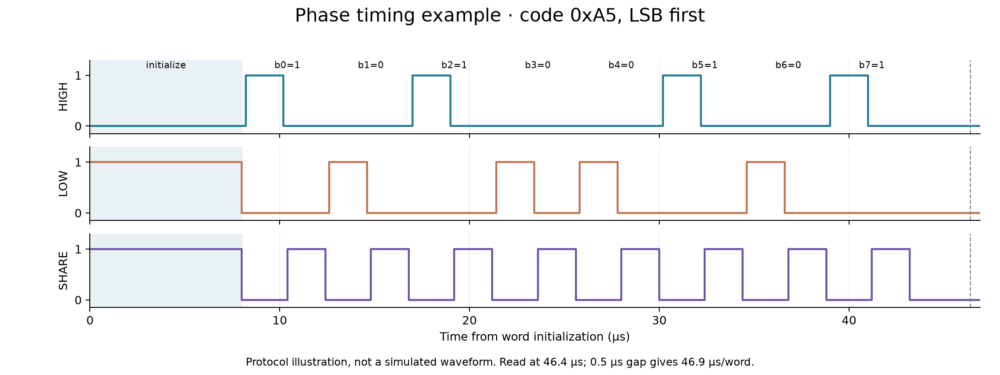

# Interface and operation

The physical top cell and Verilog module are `silicluster_jonah_2cap_dac`. `src/project.v` is an external-interface black box for the analog macro. It does not simulate analog behavior or implement timing logic. Use the supplied SPICE testbenches for circuit simulation.

| Signal | Direction | Meaning |
|---|---|---|
| VGND | Supply | Ground, 0 V |
| VDPWR | Supply | Nominal 1.8 V |
| charge_high | Digital input | Connect sample bank to vref_high |
| charge_low | Digital input | Connect sample bank to vref_low |
| share | Digital input | Share sample-bank charge with hold bank |
| vref_high | Analog input | Tested reference: 0.9 V |
| vref_low | Analog input | Tested reference: 0.2 V |
| vout | Analog output | Buffered held voltage |

Digital controls use 0 V / VDPWR. They must be supplied by an external controller. Their allocation on an analog Silicluster slot remains an organizer question. Analog references draw transient charging current; provide low-noise, sufficiently low-impedance sources. The qualification fixture uses 500 Ω in each analog path, 5 pF at reference inputs, and a 5–20 pF output load with 10 MΩ DC impedance. Final organizer pad characteristics may require retesting.

| Step | HIGH | LOW | SHARE | Duration |
|---|---:|---:|---:|---:|
| Initialize | 0 | 1 | 1 | 8 µs |
| Dead time | 0 | 0 | 0 | 0.2 µs |
| Charge bit 0 | 0 | 1 | 0 | 2 µs |
| Charge bit 1 | 1 | 0 | 0 | 2 µs |
| Dead time after charge | 0 | 0 | 0 | 0.2 µs |
| Share | 0 | 0 | 1 | 2 µs |
| Dead time after share | 0 | 0 | 0 | 0.2 µs |

Choose one charge row per bit, then repeat the charge/dead/share/dead sequence for b0 through b7. Leave all phases off for 3 µs after the last bit before reading `vout`. Read at 46.4 µs from initialization; a 0.5 µs gap gives 46.9 µs/word (about 21.3 kwords/s).

HIGH and LOW must never overlap. LOW and SHARE overlap only during initialization. Preserve dead time during transitions. Use simultaneous phase updates or hardware timing to prevent glitches. A general-purpose operating-system sleep cannot reliably produce these timings; `examples/phase_driver.py` specifies the sequence through hardware timing callbacks.

For accurate absolute output, measure codes 0 and 255 with the intended references and loading. Fit the measured endpoint slope and use `code_for_voltage` in the example. Calibration adjusts offset and gain, not all code-dependent error. The requested voltage must lie within the measured endpoint range.

Allow at least 8 µs for a full 0.7 V standalone buffer step under the tested conditions. The actual DAC sequence is verified separately at its 3 µs read delay. Refresh the held value periodically. Changing the sample bank while holding a previous output causes measurable feedthrough. See [validation](../verification/verification.md) for measured simulation limits.

Silicon bring-up: check supply/current with all controls low; establish references; initialize; measure endpoints; sweep all 256 codes; compare calibrated INL/DNL; then check protocol timing and hold behavior. Use a high-impedance measurement input. Supply ramps, final pad parasitics, ESD leakage, and remote-testing hardware must be confirmed during integration.
