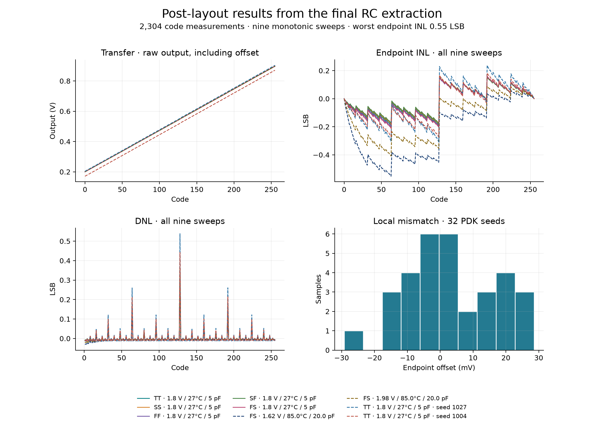
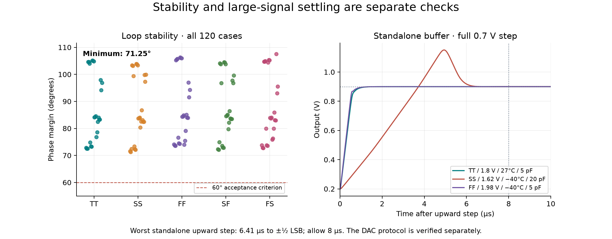

# Silicluster v3 simulation and validation

The 180 × 115 µm SKY130 macro passes native and independently re-imported GDS LVS, full Magic DRC, gate antenna checks, and the simulation criteria below. This is a prepared analog design package. **Organizer confirmation of digital phase controls and physical pin placement is still required before final submission.** No project acceptance, fabrication, or silicon measurement is claimed.

## Circuit operation and test conditions

C1 and C2 are two nominally 6.454 pF charge-sharing banks, each sixteen 14 × 14 µm MIM units in a common-centroid array. C3 is a separate nominally 1.373 pF buffer compensation capacitor; “two-capacitor DAC” refers to the conversion core. Twenty MOS transistors implement phase inversion, transmission gates, bias, and a unity-gain output buffer. Device sizes and capacitor values are preserved from the [source circuit](https://github.com/jonahsaunders/tt_sky130_um_2_cap_DAC/tree/b67d9ecd2a2fc5518c4d116b158384e28da9a48c); layout and interface are rebuilt for Silicluster.

The ideal result is Vout = 0.2 V + (0.7 V × code / 256). Initialization discharges both banks to Vref_low. For each bit, charge C1 to the selected reference, disconnect both references, then share charge with C2. Eight bits arrive LSB first. The buffer isolates the held charge from the output load.

Supply: nominal 1.8 V, tested boundaries 1.62/1.98 V. Temperatures: −40, 27, 85 °C. Process corners: TT, SS, FF, SF, FS. References: 0.2/0.9 V. Load: 5–20 pF, 10 MΩ DC. Each modeled analog terminal has 500 Ω series resistance; references include 5 pF. This fixture is a conservative test assumption, **not a confirmed Silicluster pad model**. Phase highs track supply.

Initialize for 8 µs with HIGH=0, LOW=1, SHARE=1, then leave all phases off for 0.2 µs. Each bit uses 2 µs charge, 0.2 µs dead time, 2 µs share, 0.2 µs dead time. Read 3 µs after the last share phase: 46.4 µs after word start. An additional 0.5 µs gap gives 46.9 µs/word, about 21.3 kwords/s. The simulated active reset is 7.9 µs within the initialization slot. HIGH and LOW must never overlap; LOW and SHARE overlap only during initialization. No sequencer is hidden in the Verilog black box.

## Conversion accuracy

Nine complete 256-code sweeps provide 2,304 code measurements. Five use nominal supply/temperature at each process corner. Two stress conditions are selected from the new layout's PVT probes for highest observed selected-code INL/DNL; two mismatch seeds are selected for highest observed selected-code INL/raw error. Selection is recorded in `signoff/full_configs.json`. These are worst cases **within the sampled probes**, not an exhaustive worst-case claim. Each code is initialized identically; eight ascending codes are grouped per simulation.

All nine complete sweeps are strictly monotonic. Worst endpoint INL is 0.5526 LSB; DNL spans -0.0313 to 0.5384 LSB. Acceptance criteria are |endpoint INL| < 1 LSB and every code step positive. Endpoint INL removes offset and gain; raw error retains both. One ideal LSB is 2.734375 mV.

| Case | Corner | VDD (V) | °C | Load (pF) | Seed | Max endpoint INL (LSB) | DNL range (LSB) | Max raw error (LSB) |
|---|---|---:|---:|---:|---:|---:|---:|---:|
| full_tt | tt | 1.8 | 27 | 5 | — | 0.1905 | -0.0094 to 0.3433 | 0.200 |
| full_ss | ss | 1.8 | 27 | 5 | — | 0.1831 | -0.0091 to 0.3388 | 0.187 |
| full_ff | ff | 1.8 | 27 | 5 | — | 0.2017 | -0.0100 to 0.3457 | 0.221 |
| full_sf | sf | 1.8 | 27 | 5 | — | 0.1762 | -0.0087 to 0.3297 | 0.212 |
| full_fs | fs | 1.8 | 27 | 5 | — | 0.2107 | -0.0110 to 0.3557 | 0.196 |
| full_worst_inl | fs | 1.62 | 85.0 | 20.0 | — | 0.5526 | -0.0313 to 0.3563 | 0.558 |
| full_worst_dnl | fs | 1.98 | 85.0 | 20.0 | — | 0.4086 | -0.0219 to 0.3616 | 0.357 |
| full_mc_inl | tt | 1.8 | 27 | 5 | 1027 | 0.3087 | -0.0145 to 0.5384 | 2.246 |
| full_mc_raw | tt | 1.8 | 27 | 5 | 1004 | 0.2739 | -0.0130 to 0.4420 | 10.760 |

Thirty PVT points each test ten selected codes including both endpoints and codes 127/128/129. All selected-code curves are monotonic; maximum raw error is 0.558 LSB. Thirty-two PDK local-mismatch seeds, with process mismatch disabled, also pass selected-code monotonicity. Their endpoint offset spans -29.22 to 28.59 mV. Accurate absolute voltage needs two-point calibration. See the controller example; calibration cannot extend the measured endpoint range or remove nonlinear error. Sampled mismatch does not establish manufacturing yield or include wafer-scale systematic gradients.

## Stability, startup, retention, and noise

Middlebrook voltage injection at the extracted buffer feedback gate tests 120 combinations: five corners, both supply boundaries, both temperature boundaries, three input voltages, two loads. Minimum phase margin is 71.25°; all exceed the 60° criterion.

Startup from zero stored charge, a 10 µs supply ramp, references established by 15 µs, and conversion starting at 20 µs passes the half-LSB raw-error check at nominal conditions. Three standalone buffer conditions test full-range steps. Worst half-LSB settling is 6.41 µs; worst overshoot is 250.9 mV. Allow 8 µs for full-range standalone buffer steps. Actual DAC conversion timing is separately tested by the complete code sweeps.

Four hot hold cases keep the sample bank at the opposite reference for almost 100 µs. Immediate sample-to-hold feedthrough reaches 0.2896 LSB. Subsequent 50 µs drift is at most 0.00305 LSB, below the 0.1 LSB retention criterion. Refresh periodically; changing the sample bank disturbs the held voltage.

Continuous-time buffer noise integrated from 0.1 Hz to the 10.66 kHz conversion Nyquist frequency spans 57.4–58.3 µV RMS in three cases. Estimated kT/C for 6.454 pF at 85 °C is 27.7 µV RMS. Sampled switching noise, distortion, and measured ENOB remain uncharacterized. Peak simulated conversion supply current is 280.0 µA; peak reference current is 0.318 mA.

## Physical and numerical verification

Exact area is 20,700 µm², 43.05% smaller than the source macro. All manufacturing polygons fit the boundary on a 5 nm grid. M4 power rails are vertical; M5 power rails are horizontal. All eight LEF interface rectangles exist on the corresponding GDS metal/pin layers. Two analog inputs and one analog output are within the call's analog limits; allocation of three digital phase inputs remains unconfirmed. Full DRC, native/GDS LVS, antenna reports, and geometry audit are attached. The KiCad schematic has zero ERC messages, 72 checked visible connections, and 26 verified device-property sets. MOS bodies are explicit in silicon and SPICE; their supply ties are recorded as schematic properties.

Full RC and coupled-capacitance extraction come from the delivered GDS using the fixed IIC OSIC image. Resistance threshold/minimum: 1 Ω; delay cutoff: zero. Exact star-mesh reduction removes only capacitance-free resistor nodes and preserves device/port/capacitive nodes. Raw/reduced RC, cached/full models, and 100 ns/25 ns time-step comparisons agree within 10 µV at four representative codes. Repeating a mismatch seed reproduces identical results. Detailed differences are in `signoff/special_results.json`; this supports the tested numerical approximations without proving all possible transient behavior.

A fresh build reproduces the schematic SPICE and every GDS polygon. GDS timestamps may differ. Resistor URPM mask hints must be preserved on GDS import (`gds maskhints yes`). These checks use the installed open SKY130 rules; final organizer chip-integration checks are separate.

Final GDS SHA-256: `befb7d48065a35ca57e100f0ab2846859c1f49a87afc503393072093e10a78d2`. Final reduced RC SHA-256: `cc6a3b5c6d07e2b634c93991ac60591bd67764222b210e165198f63464744e6c`. Every simulation result is audited against these hashes. `all_code_results.csv` contains all complete sweeps; JSON, simulation decks, logs, model files, native cells, and generators support reproduction. Compact packages omit redundant DUT snapshots and per-run waveform vectors; generators regenerate them. Recorded special waveforms support the included settling plots.

## Submission scope

The [supplied call](../requirements/Silicluster_v3_full_call_for_participation.pdf), pages 2–3, defines the size, analog I/O limits, required files, and M4/M5 grid. It gives digital-project I/O separately, without assigning digital controls to analog projects or a physical pin template. See [the requirements checklist](../docs/submission.md) and [organizer questions](../docs/organizer_questions.md). This macro includes no padframe, ESD cells, package model, or on-chip sequencer. No submission email has been sent.
